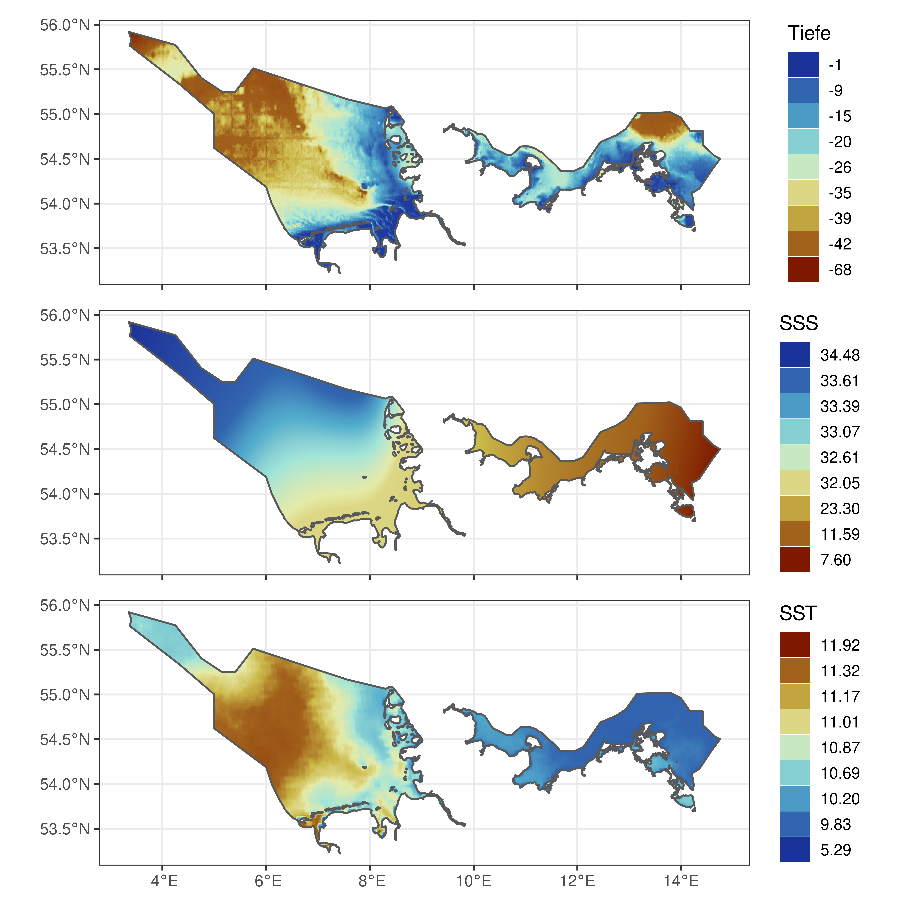
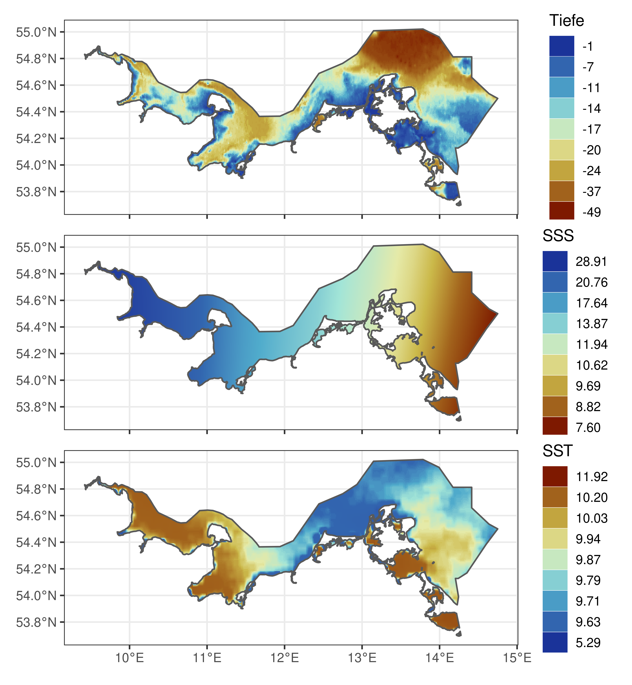
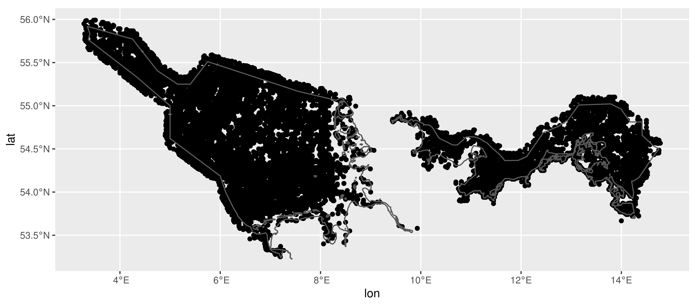
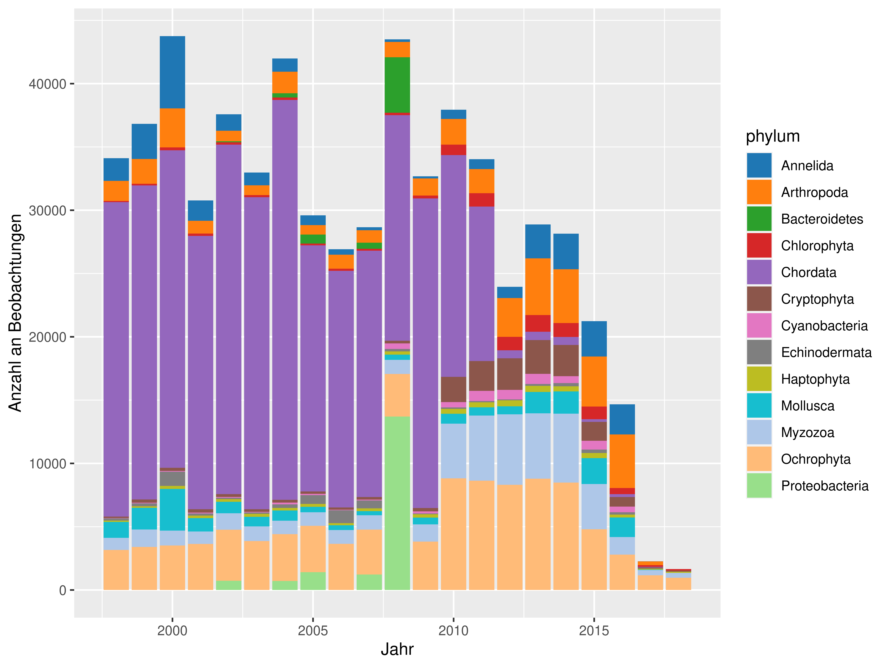
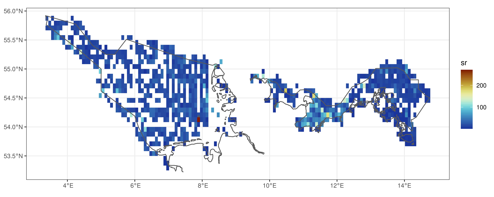
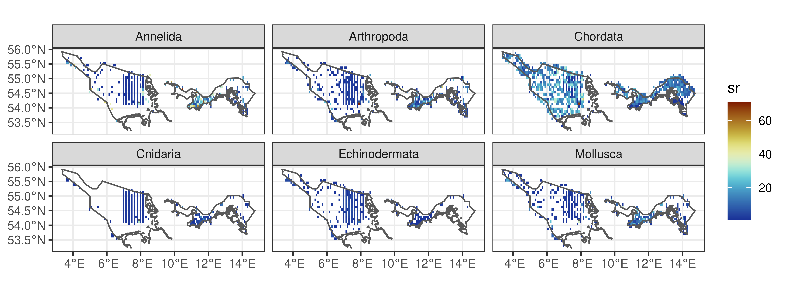
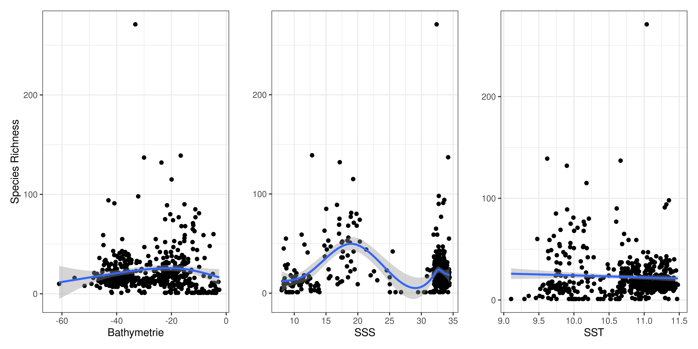
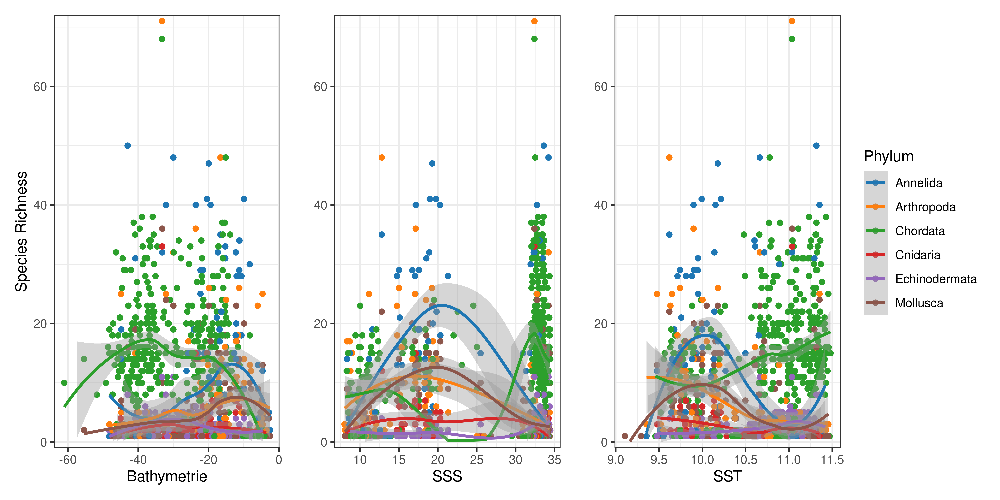

NSdiv - Basic analysis of species richness patterns and potential
drivers for the German EEZ (North and Baltic Sea)
================

### Environmental conditions of the AWZ

**Figure 1.** Environmental conditions of the German EEZ (North and
Baltic Sea).

**Figure 2.** Environmental conditions of the German EEZ in the North
Sea.

 **Figure 3.** Environmental conditions of
the German EEZ in the Baltic Sea.

### Species richness patterns of the German EEZ

**Figure 4.** Sampling locations for the German EEZ extracted from OBIS.

**Figure 5.** Number of observations per year (1998 - 2018) for the
German EEZ extracted from OBIS. Color denotes number of observations for
different phyla.

 **Figure 6.** Map of species richness
for the German EEZ inferred from OBIS records (1998 - 2018).

 **Figure 7.** Map of species
richness for several phyla for the German EEZ inferred from OBIS records
(1998 - 2018).

### Species-environment relationship of the German EEZ

**Figure 8.** Relationship between total species richness and
bathymetry, SSS and SST for the German EEZ inferred from OBIS records
(1998 - 2018) and Marspec environmental data.

 **Figure 9.** Relationship between
species richness per phylum and bathymetry, SSS and SST for the German
EEZ inferred from OBIS records (1998 - 2018) and Marspec environmental
data.
